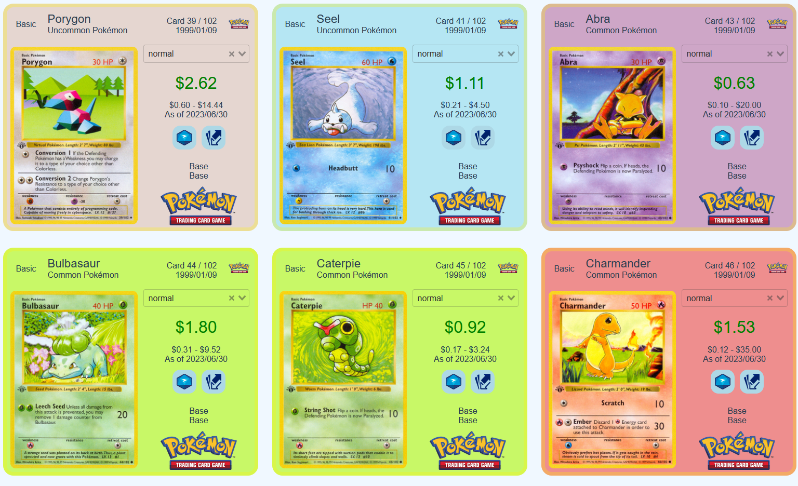

# PokeAtlas, A PokeTCG API Search Tool

## Live at [https://BluAtlas.github.io/PokeAtlas/](https://BluAtlas.github.io/PokeAtlas/)

A Vue.Js app for searching for Pokemon cards using the [Pokemon TCG API](https://pokemontcg.io/).



## Project setup

### Install dependencies

```bash
npm install
```

### Compiles and hot-reloads for development

```bash
npm run serve
```

### Compiles and minifies for production

```bash
npm run build
```

### Lints and fixes files

```bash
npm run lint
```

### Push to github pages branch

```bash
npm build dist
git commit -m "new dist"
git subtree push --prefix dist origin gh-pages
```
